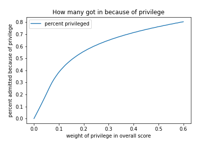
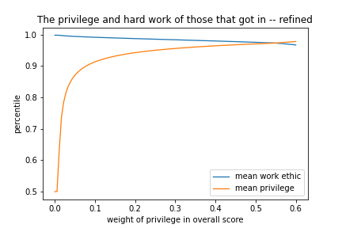

# A Simple Mathematical Model of Privilege 
The question of what privilege is and how it effects outcomes in our society is weighty. 
Answers to this question can influence how we view ourselves and our accomplishments, how we view others, and the decisions we make as we influence change in the world.
Do we view the successful as hard working and deserving of wealth, or as the lucky few that got a break? 
Do we view the poor as lazy and unproductive, or as underprivileged and unfortunate?
Do we define ourselves by our accomplishments or by our character?
These fundamental questions about outlook are shaped by how we believe the world conforms to the ideal of "you get what you work for."

Issues of privilege are baked into our society, but before we can find answers, we must build understanding.
Understanding privilege and its effects is the first step to creating true equality.

## What is Privilege?
In this exploration we will define privilege as the things that are out of our control which contribute to our success.
These are things such as the country we were born in, the wealth that we were born into, the opportunities that our parents have provided us.
Many of these things fundamentally change the opportunities and outcomes we can expect in our lives.
Good schools growing up lead to good universities which lead to good jobs, and we did nothing to choose where we went to high school, or whether or not our parents could afford tutors.
Hence, in many ways, it is difficult to extract those factors of privilege from the hard work that we have put in. 
In many ways, the privileged of the world are standing on the shoulders of giants.

However, we, as mathematicians, can very simply say that there must exist some measure of privilege.
Though we have no idea how we could find it or what exactly it means, let us assume that each person is somewhere between 0% and 100% privileged.
We make this assumption so that we can examine the effects of abstract privilege and gain concrete intuition.
This assumption does not posit that I, or any person, could empirically determine exactly how privileged any single person is, but it allows us to examine the effects of privilege, such as they are.

I would like to be very clear, that this measure of privilege does not relate in any way to how hard working a person is.
Someone can be extremely privileged and work hard; they can also be privileged and lazy.
Yet this privilege does find its way into being consequential, regardless of the character of the person.
Hence, the second measure we will examine is not "qualification" but work ethic.

We do this because there are many situations where privilege increases the qualification of a person for a certain position or accolade.
The child of a wealthy business owner may get opportunities to work in the office for example.
This experience is meaningful on a resumé or application as a qualification, yet this child got that opportunity because of privilege.
Again, this does not mean that the child didn't work hard when given the opportunity by their parent, but the opportunity was not the result of their work ethic, and yet contributes to their qualifications.

In many ways, work ethic is the measure rather uninfluenced by privilege, and I hope that the distinction between these two measures is meaningful.

## Getting into the Ivy League
Now that we understand the two measures we want to examine, we can begin with our first example.
In this example we will examine imagined students applying to Harvard.
For each student we will generate a random number between 0 and 1 to represent their work ethic, and another number between 0 and 1 to represent their privilege.
We then create a score, based on how much we imagine privilege matters in society.
If we suppose that privilege determines, say, 10% of why a person gets into Harvard, then we follow this formula: .1\*privilege + .9\*work ethic = score.
This score is then used to determine if the student "gets in" to harvard.

It's important to note we are not assuming the registrar is looking at a student's work ethic and privilege and then determining if they get in or not.
The effects of privilege are baked into society and together with work ethic, determine a student's qualification for being admitted.

Since we cannot know how much privilege actually factors into why a person gets accepted into Harvard, we will run many simulations with different values for that factor, which we will call bias.
For each value of bias, we will examine the mean work ethic and privilege of the students that were accepted.
We will also compare the group that was accepted because of their score with the group that would have been accepted if only work ethic mattered.
Because privilege has some effect, there must surely be people that would not have been admitted had they not been privileged. 
This does not mean that these people are not hard workers, but it does mean that they were accepted because of privilege.

## The Class of Privilege
In order to be confident in the results I ran 1,000 simulations at each bias value, and for smooth curves I chose 100 different values of bias.
In each simulation I created 33,824 students, each with a random work ethic and privilege value.
I chose this number because that is the number of people that applied to enter the Harvard class of 2024.
Of those 33,824 applicants only 1,085 were accepted, so in our simulation we will look at the top 1,085 students based on score.

In the figure below we see the mean work ethic and mean privilege of the accepted applicants for each value of bias between 0 and .6.
I was surprised to see that  between 0 and .2, a small change in bias results in a large change in mean privilege.
Meaning that even if privilege matters very little, it will still result in a high standard of privilege for those that get in.

Even if we are generous, and assume that privilege only explains 20% of why someone got into Harvard, the applicants that get in are are still very privileged.
With this assumption they are, on average, above the 80th percentile for privilege.
It is also important to note that the accepted students are all very hard working, much more than average, around the 95th percentile, yet they are, nonetheless very privileged.

In the image below we see just how much privilege matters.
The curve follows a similar shape to the mean privilege curve above, but represents something very different.
As I explained earlier, we are comparing the people that got in because of their score value with those that would have been admitted if only work ethic mattered.
This curve gives the percentage of accepted applicants that would not have been admitted if only work ethic mattered.

### Refining the Pool
Yet we know that the students applying to Harvard are not just random students.
Those that apply to Harvard are among the best students that have graduated from high school.
So because of our assumption our perspective is limited; we are ignoring the fact that these students have already proven themselves against another larger group.
But how can we know the distribution of work ethic and privilege of the students that have applied?

One way to approximate the distribution is to modify the simulation.
Let consider all the students that graduated in 2019.
This gives us a pool of 3.7 million students, each with a work ethic and privilege value.
We can't be certain that only the top 33,824 best students applied, but we might assume that the students that applied were all above the 90th percentile.
Since there are 370,000 students above the 90th percentile, we will then choose 33,824 students randomly from that group.
These randomly chosen students will be the applicants, and from that group we will select the 1,085 best scoring students as those admitted into Harvard.

The goal of this procedure is to simulate the appropriate distribution of work ethic and privilege of the applicants to Harvard, so that we can better understand the effects of privilege on who gets admitted into Harvard.

As we can see, and should have expected, the effects of privilege are accentuated when we take into account the effects of privilege on those that even apply to Harvard. 
The mean privilege of those admitted is very high, even for extraordinarily small values of bias.
This of course doesn't invalidate the hard work of those that got in, because the mean work ethic is very high, even for large values of bias, but we do see that high levels of privilege become common, or rather necessary, in situations like this.

This story is especially strong when we see the percentage of people that got in because of privilege.
In this case, we are not just comparing the admitted group to the applicant group, we are comparing the admitted group to the entire high school graduate group.
There are ostensibly many people that do not apply because of a lack of privilege.
For example, the Harvard application fee is $75 and there could be many students that are very hard working, but not privileged enough to afford that fee.
These people could be hard working enough to get in, if that were the only qualification, but because there are other limiting factors privilege becomes consequential.

This example may convince us that privilege is much more meaningful in determining the success of a person than we would have originally expected.
Especially when we can have privilege explain more the 50% of why someone is successful, and still have successful people be extremely hard working. 

## The Great and Privileged Among Us
The world is a competitive place, and in a world that is somewhat unwilling to spread its resources evenly, that competition creates an inflated need of privilege to achieve success.
For example we might look at all the people that get an MBA with goals to become a CEO.
There are about 1,792,000 people with an MBA in the US.
If we assume that a little more than 5% of those people generally have the goal of becoming the CEO of a Fortune 500 company we have 100,000 people competing for 500 positions.
It is in cases like these where privilege becomes necessary, even in an ideal society where privilege matters very little.

I ran 100,000 simulations with the assumption that privilege determines only 5% of why someone becomes a CEO.
Even with that generous assumption, I found that on average of the 500 CEOs almost all of them, 99.8%, would not have become a CEO had they not been privileged.

Remember, I am not saying that we can be certain 99% of all Fortune 500 CEOS are only CEOs because of privilege, nor am I saying that none of them work hard.
In fact all of the candidates that became CEO had very high work ethic scores.
This application simply gives us an intuition for understanding how much privilege can factor into outcomes in society.
Even if we can be convinced to believe that privilege has almost no influence in success, we still find that those that are successful are often successful because of privilege.

## The Wider World
If we use our score as a measure of the probability of becoming successful we can apply the intuition we've gained in the Harvard example to the wider world.
We can now apply this analysis to any aspect of life on which we measure success.
Though we must take care in how we implement policies, we can use what we have learned to truly make the world a better more equal place.
We only need to be clear about the things we think may contribute to privilege.

Let us consider the whole of America, though I would have liked to consider the whole world, but my computer would need to be about 10 times more powerful.
Of the 328.2 million people, how privileged are the top 1%, how about the top .01%?
Certainly they work hard, but how much of their wealth and success is determined by privilege?
It will come as no surprise to you to learn that 

# Works Cited
[1] https://nces.ed.gov/blogs/nces/post/back-to-school-by-the-numbers-2019-20-school-year

[2] https://www.toptieradmissions.com/resources/college-admissions-statistics/harvard-university-acceptance-rates/

[3] https://www.vox.com/2014/5/20/5734816/masters-degrees-are-as-common-now-as-bachelors-degrees-were-in-the-60s

## Footnotes
[a] This is inspired by a veritasium video that explores more of the social consequences of privilege.